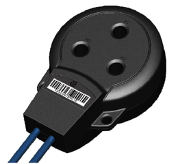
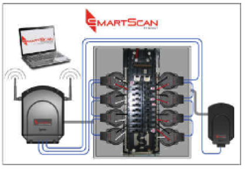
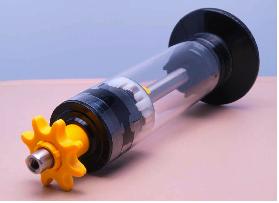
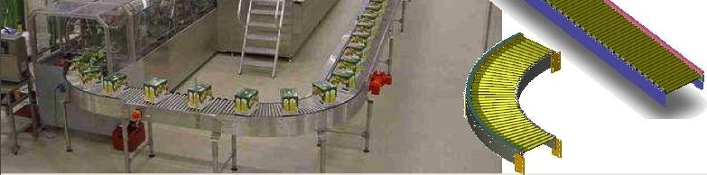
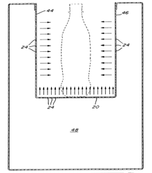
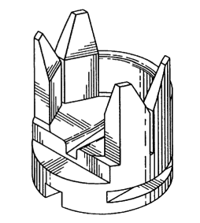
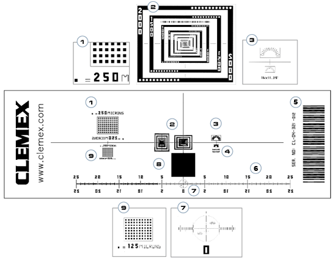
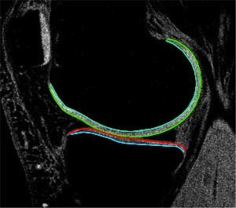
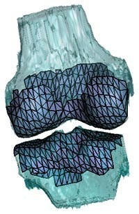

# Yvan Ross profile

## École de technologie supérieur (ÉTS)
### Lecturer

- [LOG121](https://www.etsmtl.ca/etudes/cours/log121) - Conception orientée objet
- [LOG210](https://www.etsmtl.ca/etudes/cours/log210/) - Analyse et conception de logiciels
- [LOG430](https://www.etsmtl.ca/etudes/cours/log430/) - Architecture logicielle
- [MGL802](https://www.etsmtl.ca/etudes/cours/MGL802) - Principes et applications de la conception de logiciels
- [MGL844](https://www.etsmtl.ca/etudes/cours/MGL844) - Architecture logicielle

# **Open source projet: G**enealogy **O**f **M**y **P**hotos

This project consist in building multiplatform applications to archive and share photos at cheapest cost possible.

It is based on a peer-to-peer architecture. The main goal is to keep at least one copy of your photos and video on a remote location at cheapest cost possible.   

You and your friends will have a one time investisment to do in a external disk to put a copy of your media as well a a copy of your friend data.

Visit github repository to see the status of the project: https://github.com/yvanross/gomp

# Domain expertises

## Information technology
- Identification of customer needs
- Prototyping of the application and user interfaces
- Modeling of the database structure
- Communication with the graphic designer
- Implementation of the solution
 
Our designs are prototyped using the Axure application and our layouts are done exclusively with the Ruby on Rails platform. Ruby on Rails is a very structured web application development environment.

## Industrial computing
- Industrial computing mainly concerns software that interacts with electronic hardware. Whether with a computer, a microcontroller or a DSP, we may be able to help you. 

- Your development platforms are: C ++, Matlab with Simulink and Real time workshop or Code composer studio. So don't hesitate to contact us. 

## Scientific computing
- The solutions developed by the researchers are brilliant. They generally allow very complex problems to be solved. When they have found the right solution, we try to quickly put the prototype into production mode by deliberately neglecting the integration phase. 

- This usually works for a few months and then the problems start. It then becomes very complex to add the operational functionalities required by customers. The solution becomes more and more unstable as we try to add new features. The architecture requires major changes and customers cannot afford to wait for the new solution. 

- Over the past few years, we have developed very good expertise in taking these prototypes, redoing the software architecture and making them capable of evolving in a competitive environment. 
	
# Realized projects

## Electrical signal sensor
Project management, R&D and development of signal processing software in an embedded environment on DSP

||

 Technologies:
  - DSP Texas instrument
  - Matlab/Simulink/Realtime workshop, C++ 

## Pressureless roller conveyor with magnetic clutch

 
- Technologies: 
  - Plastic molding
  - Magnetic coupling
  - 3D design
  
https://www.sidel.com/en/conveying/packs-and-cases-conveyors/magneroll-roller-conveyor-pd-400"

## Development of air conveyor for cans and bottles

- Technologies: 
  - Laser drilling
 
http://www.freepatentsonline.com/6040553.pdf

<b>Projet: Développement de support pour le convoyage de sachet flexible

- Technologies: 
  - Moulage plastique, Conception 3D
	http://www.freepatentsonline.com/D426366.pdf

## Digital image processing and measurement

 
https://www.clemex.com/stage-micrometer-slide/

Sofwtare and calibration ruler in dimension and grain size for automated microscope. 

- Technologies: 
  - Parallel computing
  - Computer vision
  - 2D image analysis
  - High precision photolithography
  - NIST certification
# Knee cartilage volumetric measurement tool
 
 
                 
- Technologies:  
  - 3d mesh
  - Ray launch 
  - Surface intersection
  - 3D registration
  - Surface projection
  - Workflow de calcul

### Publications
> Li, W., Abram, F., Ross, Y., Dodin, P., Beaudoin, G., Berthiaume, M-J., Raynauld, J-P., Pelletier, J-P., Martel-Pelletier, J.: New quantitative MRI technology can reliably assess human hip cartilage volume and thickness and discriminate the acetabulum from the femoral head. Ann. Rheum. Dis. 67:FRI0326, 2008, 8th European Congress on Clinical and Economic Aspects of Osteoporosis and Osteoarthritis (ECCEO8) - Istanbul, Turkey, April 2008 AND Osteoarthritis Cartilage 15:C176, 2007.

> Li, W., Abram, F., Ross, Y., Dodin, P., Beaudoin, G., Berthiaume, M-J., Raynauld, J-P., Pelletier, J-P., Martel-Pelletier, J.: New quantitative MRI technology can reliably assess human hip cartilage volume and thickness and discriminate the acetabulum from the femoral head. Osteoarthritis Cartilage 15:C176, 2007.

# Programming languages
- Ruby on rails
- Golang
- Flutter/Dart
- C++
- Java
- Typescript
- Matlab
- Simulink

# Contact me

Yvan Ross, Ing., M.Ing 
Richelieu, Qc, Canada
yvan.ross@gmail.com 
514-797-8894 
http://ca.linkedin.com/in/yvanross/ 

	
	 